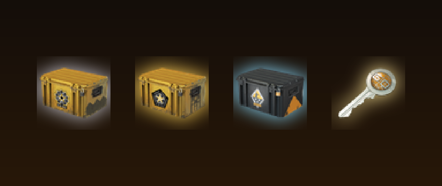

# Cases Simulator

**Case opening in Minecraft: keys, cases in three tiers, and a roll for loot.**

---

Right-click a **case** while you carry a **Case Key** and roll for a reward. There are silver, gold and diamond cases; the better the case, the better the odds for rare and legendary loot - a legendary pull is announced in chat as a jackpot.

## What it does

- Silver, Gold and Diamond cases with different rarity odds (common, uncommon, rare, legendary)
- Case Key item with a crafting recipe
- Big loot pools of vanilla items, from planks to netherite gear and dragon eggs
- Jackpot announcement for legendary pulls

## Download

Download **`Cases-Simulator-v1.2.22.mcaddon`** from the [releases page](../../releases) (or straight from this repository) and open it - Minecraft imports the packs.

1. Create or edit a world and open **Add-Ons**.
2. Activate the **Behavior Pack** and the **Resource Pack** of this add-on.
3. Requires Minecraft Bedrock **1.21.110 or newer**.

If items are missing in your world, check the world's *Experiments* page and enable *Beta APIs* and *Holiday Creator Features* as a fallback.

New to this? Follow **[SETUP-HELP.md](SETUP-HELP.md)** - it walks you through installing and starting it.

## Dev Book

Every pack of mine carries a small easter egg: craft the **Dev Book** with **9 logs** (any wood type, 3x3 in a crafting table) and right-click it. It opens like a book: page 1 the credits, page 2 what this mod is, page 3 the GitHub links (Minecraft cannot open links, so they are shown as text). It also sits in the creative inventory under *Equipment*.

## Notes

- Case and key artwork is inspired by Counter-Strike. Not affiliated with or endorsed by Valve; Counter-Strike is a trademark of Valve Corporation. If the rights holder objects, it will be taken down.
- Not an official Minecraft product. Not approved by or associated with Mojang or Microsoft.

---

Made by **dev:#2444** - [github.com/hash2444](https://github.com/hash2444) - [cases-simulator](https://github.com/hash2444/cases-simulator)
